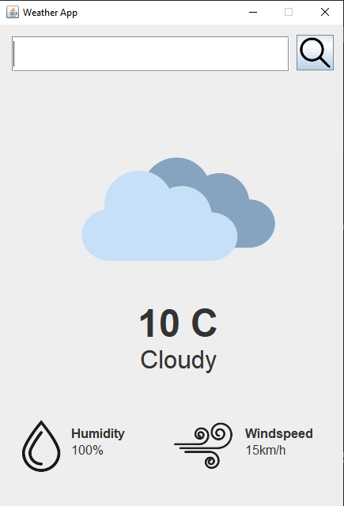

# WeatherWiz

WeatherWiz is a Java application that retrieves and displays weather data for a given location using the Open-Meteo API. The application features a graphical user interface (GUI) built with Swing.

## Features
- **Weather Data Retrieval:** Fetches current weather information for any specified location.
- **Graphical User Interface:** A user-friendly GUI to display the weather data, including temperature, weather conditions, humidity, and wind speed.
- **Dynamic Updates:** Updates weather information based on user input.

## Usage

### Running the Application
1. **Clone the Repository:**
    ```sh
    git clone https://github.com/yuneshwaran/WeatherWiz.git
    cd WeatherWiz
    ```
1. **Open Android Studio:**
    Build and Run the App from AppLauncher.java

<p align="center">
  
</p>
### Using the GUI
1. **Search for a Location:**
    - Enter the name of a location in the search field.
    - Click the search button to retrieve and display weather information for the specified location.

2. **Displayed Information:**
    - **Weather Image:** An icon representing the current weather condition (e.g., clear, cloudy, rain, snow).
    - **Temperature:** The current temperature in Celsius.
    - **Weather Condition Description:** A text description of the weather condition.
    - **Humidity:** The current humidity level.
    - **Windspeed:** The current wind speed.

## API Reference

### `WeatherWiz.getWeatherData(String locationName)`
Fetches weather data for the specified location using the Open-Meteo API.

- **Parameters:**
    - `locationName` (String): The name of the location for which to fetch weather data.

- **Returns:**
    - A `JSONObject` containing weather information:
        - `temperature` (double): The temperature in Celsius.
        - `weather_condition` (String): The weather condition (e.g., Clear, Cloudy, Rain, Snow).
        - `humidity` (long): The humidity percentage.
        - `windspeed` (double): The wind speed in meters per second.


## License
This project is licensed under the MIT License. See the [LICENSE](LICENSE) file for details.